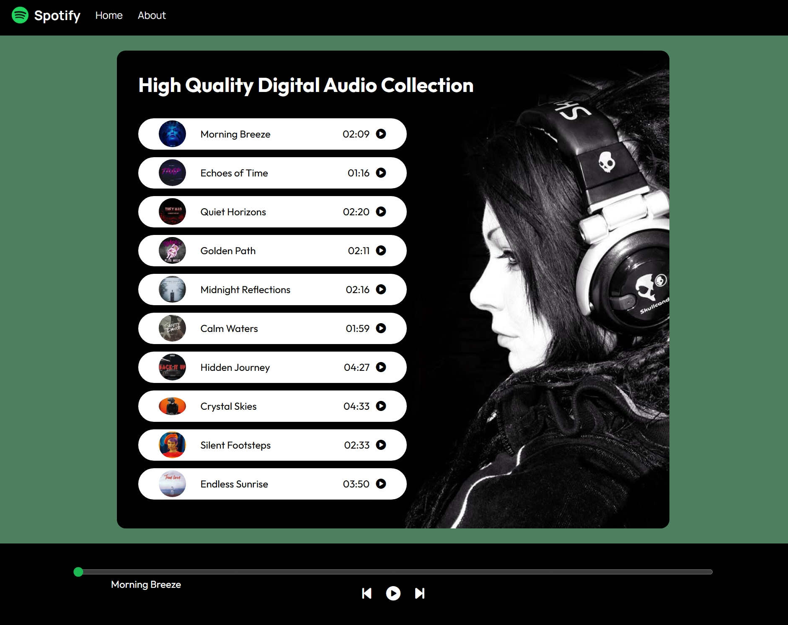

# Spotify Clone

A responsive Spotify-inspired music player built with **HTML, CSS, and JavaScript**. This project allows users to play songs, navigate through a playlist, control playback, and interact with a dynamic progress bar using the JavaScript Audio API.

## Live Demo

**View the project here:**
https://your-project-name.vercel.app

---

## Features

- Play and pause music
- Play songs directly from the playlist
- Next and Previous controls
- Interactive seek/progress bar
- Automatically plays the next song when the current track ends
- Animated "Now Playing" indicator
- Dynamic song titles and cover images
- Clean and responsive user interface

---

## Built With

- HTML5
- CSS3
- JavaScript (ES6)
- Font Awesome

---

## Folder Structure

```text
Spotify-Clone/
│── covers/
│── songs/
│── logo.png
│── bg.jpg
│── playing.gif
│── index.html
│── style.css
│── script.js
└── README.md
```

---

## Running the Project Locally

1. Clone the repository:

```bash
git clone https://github.com/Tayyaba-Amin/Spotify-Clone
```

2. Open the project folder.
3. Open `index.html` in your browser.
   No additional packages or installation steps are required.

---

## Concepts Practiced

- DOM Manipulation
- Event Handling
- JavaScript Audio API
- Arrays of Objects
- Functions
- Loops
- Dynamic UI Updates
- CSS Flexbox
- Responsive Design

---

## Preview

<p align="center">
  
</p>

---

## Author

Tayyaba Amin
GitHub: https://github.com/Tayyaba-Amin
LinkedIn:Tayyaba-Amin https://github.com/Tayyaba-Amin

---

## License

This project was built for learning and educational purposes.
